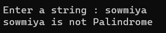

# Palindrome


## Aim:
To write a C# program to find whether the given string is a Palindrome or not.
## Algorithm:
### Step 1:
Import the 'System' namespace to use the classes present in the 'System' namespace.
### Step 2:
Declare the Main method.
### Step 3:
Declare name variable in string format and declare an empty string to reverse the string input.
### Step 4:
Using " Console.Write " print the statement and get the input from user using " Console.ReadLine " .
### Step 5:
Using for loop reverse the input string and store it in rev.
### Step 6:
Using if else loop check whether the input string and the reversed string are same. If same print they are palindrome or else print they are not palindrome.
### Step 7 :
Print the result.
## Program:
```
using System;
namespace palindrome
{
    public class Program
    {
        static void Main(string[] args)
        {
            string str1;
            string rev = "";
            Console.Write("Enter a string : ");
            str1= Convert.ToString(Console.ReadLine());


            for (int i = str1.Length - 1; i >= 0; i--)
            {
                rev += str1[i];
            }

            if (str1 == rev)
            {
                Console.WriteLine("{0} is Palindrome.",str1);
            }
            else
            {
                Console.WriteLine("{0} is not Palindrome",str1);
            }
        }
    }
}

```
## Output:
;
;
## Result:
Thus the C# program to display whether the given string is Palindrome or not is executed successfully.
